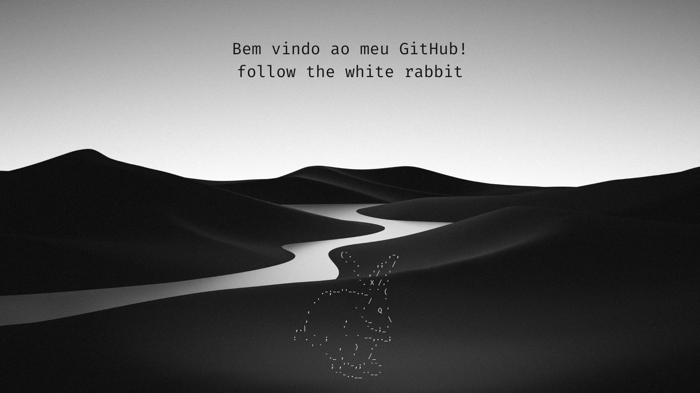

  
  
  </a>
  
  

 

<h2 align="center">  <em>Sobre Mim </em></h2>

 

  Olá, meu nome é <b>Kaio</b> e sou estudante de Defesa Cibernética, com foco em Blue Team, especialmente nas áreas de SOC e Threat Intelligence. Tenho grande interesse por desafios práticos, participando ativamente de CTFs, com destaque para a plataforma TryHackMe, onde busco constantemente aprimorar minhas habilidades técnicas e analíticas.

Além da área técnica, sou apaixonado por leitura e escrita. Mantenho um blog onde publico resoluções de CTFs, compartilhando aprendizados e contribuindo com a comunidade de segurança da informação. Em breve, também lançarei um novo blog voltado para acadêmicos do meu município, com o objetivo de incentivar o estudo, a troca de conhecimento e o desenvolvimento profissional.

 

      <em><b> Estudante da Estácio - Defesa Cibernética </b></em>  
      <em><b> Top 100 BR no TryHackMe </b></em> 
      <em><b> follow the white rabbit </b></em> 

 
 
<h2 align="center">  <em> Tecnologias </em> </h2>

  
  
  
  
  
  
  
  
  
  
  
  
  
  
  

 
 

<h2 align="center"">  <em> Estatísticas </em> </h2>

 

    

